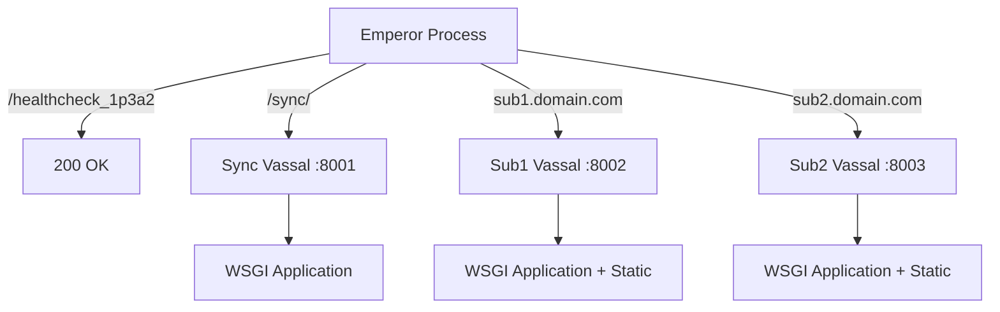

When deploying Python web applications, the choice of application server can make or break your performance goals. Back in 2022, I had a client with a dilemma: a production site on a tiny server—2 cores and 4GB of RAM—and a strict "no more money" rule for infrastructure. On a box this small, every extra daemon or reverse proxy layer is a meaningful tax. uWSGI's emperor mode turned out to be the perfect fit.

After running production systems with uWSGI for several years since that 2022 decision, I've found its emperor mode and advanced routing capabilities provide solutions that are difficult to replicate with other application servers.

## Why uWSGI in 2022 (and Still Valid Today)?

When I chose uWSGI in 2022, it was already in maintenance mode, but it remained a strong choice for certain types of production environments—especially mid-scale monolithic or multi-tenant applications where simplicity and stability are priorities over bleeding-edge features.

**Why teams may still choose uWSGI:**

- **Mature and feature-rich**: Built-in routing, process management, and static file serving without additional layers
- **Proven stability**: Battle-tested in production for over a decade with minimal upgrade requirements
- **Efficient process model**: Emperor mode provides clean process isolation and zero-downtime reloads
- **Performance optimizations**: Regex JIT compilation, offload-threads, and aggressive caching for low-latency performance

**The upgrade experience has been excellent**: Since choosing uWSGI in 2022, I've upgraded Python versions, Django versions, and applied security patches seamlessly. The maintenance-mode status hasn't translated to any practical problems—quite the opposite, the stability has been remarkable.

**However, there are significant trade-offs:**

- **Maintenance-only status**: While stable and upgrade-friendly in my experience, future Python releases could eventually introduce compatibility risks
- **Not ideal for async workloads**: Modern ASGI servers (Uvicorn, Hypercorn) outperform uWSGI for async applications
- **Static file serving trade-offs**: Nginx, CDNs, or object stores are generally better at high scale
- **Limited observability**: Integrating advanced monitoring or distributed tracing is harder than with container-native solutions
- **Legacy fit**: Best suited for "pets, not cattle" environments with predictable workloads

uWSGI shines when you value **predictable performance, operational simplicity, and minimal moving parts** over adopting new infrastructure patterns.

## uWSGI Emperor Tutorial: Managing Multiple Applications

The emperor mode allows a single uWSGI process to manage multiple "vassal" processes, each handling different applications or configurations. Here's the main emperor configuration:

```ini
# ./uwsgi.ini - Emperor config
[uwsgi]
emperor = ./vassals.d/router_*.ini
emperor-pidfile = /tmp/uwsgi.pid
socket = :8000

log-format = [%(ctime)] %(addr) &#123;%(vars) vars in %(pktsize) bytes} %(method) %(host) %(uri) => generated %(rsize) bytes in %(msecs) msecs (%(proto) %(status)) %(headers) headers in %(hsize) bytes (%(switches) switches on core %(core))

master = true
single-interpreter = true
pcre-jit = true
socket-timeout = 30
http-timeout = 30
buffer-size = 16384
log-master = true
limit-as = 1024
reload-on-rss = 1536

route-uri = ^/healthcheck_1p3a2$ return:200
route-uri = ^/sync/ uwsgi:127.0.0.1:8001,0,0,sync
route-host = ^sub1\.domain\.com$ uwsgi:127.0.0.1:8002,0,0,sub1
route-host = ^sub2\.domain\.com$ uwsgi:127.0.0.1:8003,0,0,sub2
```

The emperor watches for configuration files matching `router_*.ini` and automatically spawns vassals for each. The routing rules demonstrate different approaches:

- `route-uri = ^/pattern/ uwsgi:ip:port,0,0,label` - matches request paths using regex
- `route-host = ^domain\.com$ uwsgi:ip:port,0,0,label` - matches the Host header using regex

The health check endpoint returns a 200 status directly from uWSGI without hitting the application, providing fast health checks for monitoring.

## Architecture Overview



## Vassal Configuration Patterns

Each vassal inherits common settings while defining its specific requirements:

```ini
# ./vassals.d/common.ini - Shared configuration
[uwsgi]
chdir = /usr/src/app/
mime-file = /usr/src/app/mime.types
single-interpreter = true
enable-threads = false
processes = 1
max-requests = 1000
max-worker-lifetime = 3600
worker-reload-mercy = 60
buffer-size = 16384
log-master = true
pcre-jit = true
```

```ini
# ./vassals.d/public.ini - Configuration for public-facing vassals
[uwsgi]
include = %dcommon.ini

workers = 2
offload-threads = 4

static-safe = /usr/local/lib/python3.12/site-packages/
static-expires = /app/* 3600

check-static = /var/www/static/
static-map = /static=/var/www/static/
static-expires = /static/.* 23328000

check-static = /var/www/media/
static-map = /media=/var/www/media/
static-expires = /media/.* 23328000
```

```ini
# ./vassals.d/sync.ini - Long-running operations
[uwsgi]
include = %dcommon.ini
pidfile = /tmp/sync.pid

harakiri = 10800
http-timeout = 10800
max-worker-lifetime = 1800
worker-reload-mercy = 900

module = core.app:application
uwsgi-socket = 127.0.0.1:8001
```

```ini
# ./vassals.d/sub1.ini - Domain-specific configuration
[uwsgi]
include = %dpublic.ini
pidfile = /tmp/sub1.pid

module = core.app:application
uwsgi-socket = 127.0.0.1:8002
```

The `offload-threads` setting allows uWSGI to serve static files in separate threads, preventing static file requests from consuming application worker processes. Memory limits (`limit-as`, `reload-on-rss`) prevent runaway memory usage and ensure system stability.

**Note on static file serving**: While uWSGI can serve static files efficiently with offload threads, dedicated web servers like nginx or CDNs are generally more optimized for this at scale. This approach works well for small to medium deployments where operational simplicity outweighs pure performance optimization.

## Nginx Reverse Proxy Setup

nginx serves as the frontend reverse proxy. Key configuration for connecting to uWSGI:

```nginx
location / {
    include uwsgi_params;
    uwsgi_buffers 32 12k;
    uwsgi_read_timeout 60;
    uwsgi_pass localhost:4321;
    proxy_cookie_path / "/; HTTPOnly; Secure; SameSite=strict;";
}

location /sync/ {
    include uwsgi_params;
    uwsgi_read_timeout 10800;
    uwsgi_send_timeout 10800;
    client_max_body_size 100M;
    uwsgi_pass localhost:4321;
    auth_basic "Restricted Content";
    auth_basic_user_file /var/www/htpasswd/sync.htpasswd;
}
```

This lets nginx handle SSL, basic auth, and connection management while uWSGI manages application routing and static files.

## Production Monitoring

A simple monit configuration provides reliable process monitoring:

```
CHECK HOST webshop WITH ADDRESS 127.0.0.1
if failed port 8301 protocol HTTP
  request /healthcheck_1p3a2
  with timeout 10 seconds
  for 4 cycles
then alert
```

On larger deployments you'd typically use Prometheus exporters and richer observability stacks. But on resource-constrained servers, Monit is lightweight and reliable without consuming significant CPU/memory. When your monitoring infrastructure would consume more resources than your applications, simple wins over comprehensive.

**Security note**: The health check endpoint should be restricted by firewall rules or nginx access controls.

## When This Approach Makes Sense

This uWSGI configuration works well for:

- Multi-tenant applications requiring domain-based routing
- Deployments where minimizing infrastructure complexity is important
- Production environments where proven stability outweighs cutting-edge features
- Small business deployments on resource-constrained servers
- Mid-scale applications handling thousands to tens of thousands of daily requests

In my experience, this setup can comfortably handle 100-500 requests/second depending on application complexity.

## When You Need More Than This Setup

This approach has limitations for certain scenarios:

- **High-traffic applications**: Apps serving millions of requests per day will hit uWSGI's routing bottlenecks. You're limited by routing happening in one place, and need dedicated load balancers for 1000+ concurrent requests.
- **Complex microservices**: Requires service mesh capabilities, circuit breakers, and distributed tracing that uWSGI doesn't provide. Container orchestration platforms like Kubernetes are better suited.
- **Extensive observability needs**: Modern apps often need detailed performance monitoring, distributed tracing, and integration with Grafana/Jaeger/DataDog. Adding these defeats the simplicity advantage.
- **Dynamic scaling requirements**: Emperor mode's static vassal configuration doesn't support auto-scaling workers based on load or handling traffic spikes automatically.
- **Modern deployment patterns**: Teams preferring container-native solutions with declarative deployments and GitOps workflows may find uWSGI's configuration-file approach outdated.

The key is matching your tool choice to your actual requirements rather than aspirations.

## Conclusion

uWSGI's combination of performance, features, and stability makes it an excellent choice for specific production environments. The emperor mode provides sophisticated process management, while built-in routing and static file capabilities reduce infrastructure complexity.

For applications requiring these capabilities, uWSGI's maintenance status matters less than its ability to reliably serve applications with minimal resource overhead. In existing projects where uWSGI is already working well, there's little reason to replace it—upgrades continue to work smoothly, Python compatibility remains solid, and security patches apply without issues. Sometimes the best tool for the job is the one that simply works, year after year, without requiring constant attention.

If you're running containerized workloads and this approach doesn't fit your needs, consider looking into modern alternatives like [Kubernetes ingress controllers](https://kubernetes.io/docs/concepts/services-networking/ingress/) or [Traefik](https://traefik.io/) for more dynamic, cloud-native routing solutions.
