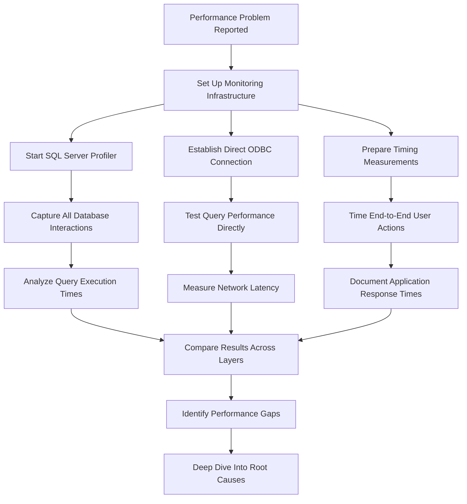

Back in 2014, I found myself in the middle of what can only be described as a technical war zone. An IT service provider, a software company, and their mutual client were locked in an escalating dispute that could have been heading for the courtroom. The stakes were high, fingers were pointing in all directions, and everyone was convinced they were right.

The battlefield? An application that was unusably slow, with every view taking 4-8 seconds to load—an eternity in user experience terms. But the real problem was deeper: every single interaction was affected. Searching for a patient meant waiting for search results to update with each keystroke (4-8s each since lookups were immediately triggered, not waiting for the user to stop typing for quarter-half a second). Once found, opening the patient record took another 4-8 seconds. Navigating to procedures or personal data: another 4-8 seconds. Loading a form: 4-8 seconds more. Saving changes and receive a confirmation/error message: yet another 4-8s. What should have been a 20-30 second workflow was taking 2-3 minutes per patient interaction, creating bottlenecks throughout the hospital's daily operations.

## The Setup: Three Parties, One Problem

The scenario was textbook corporate finger-pointing:

- **The Client**: A hospital running critical software that was painfully slow, affecting daily operations
- **The Software Vendor**: Claiming their application was fine and blaming the Database infrastructure  
- **The IT Provider**: Insisting their Database setup was running perfectly smooth

The IT provider was facing serious accusations. The software vendor was claiming their hardware was "sub-par" and causing the performance problems. With litigation looming and reputations on the line, the IT provider brought me in to assess whether their infrastructure was truly the bottleneck. While they were obviously hoping I'd vindicate their setup, they needed credible technical analysis that would hold up under scrutiny.

## The Detective Work Begins

My approach was methodical. I needed to eliminate variables one by one and follow the data trail wherever it led. Here's how I structured the investigation:

### Step 1: Setting Up the Crime Scene
- Connected SQL Server Management Studio to the test database
- Started SQL Profiler to capture all database interactions  
- Created a monitoring profile specifically for the problematic application
- Prepared multiple test scenarios with stopwatch timing

### Step 2: Testing the Usual Suspects

**Network Performance**: The first suspect was always network latency. I established a direct ODBC connection from a client machine to the SQL Server and ran the exact same queries that the application was executing. Result? Virtually no network delay—queries that took fractions of a second on the server arrived at the client just as quickly.

**SQL Server Hardware**: Running on a virtualized server with 4 Xeon cores, the SQL Server 2008 instance was handling requests efficiently. Database queries were completing in 0.02 (simple SELECT) to 0.2 seconds (expensive DISTINCT etc.) consistently.

**Database Design**: I randomly sampled tables and indexes, checking for performance bottlenecks. While some tables had numerous indexes (which could slow down writes), the SELECT performance was excellent across the board.

## The Smoking Gun: A Tale of Two Timings

Here's where things got interesting. Using a stopwatch, I measured the end-to-end user experience:

- **SQL Server cumulative query execution time**: 0.1-0.5 seconds
- **Application response time**: 4-8 seconds  
- **Unaccounted time**: 62.5% to 81.25% of the total delay

The math was damning. Even accounting for the most pessimistic network overhead (1 full second), there were still 3-7.5 seconds completely unaccounted for. The bottleneck wasn't in the infrastructure—it was entirely in the application layer.

## Uncovering the Real Culprit

Digging deeper into the SQL traces revealed several problematic patterns:

### The Interface Data Problem
The application wasn't just fetching business data—it was pulling massive amounts of interface metadata from the database for every single screen. Tab labels, formatting rules, layout information—all coming from individual database queries instead of being cached or bundled efficiently.

### The Sequential Query Problem  
Instead of intelligent batching, the application fired off dozens of small, rapid-fire queries for each user action. While each individual query was fast, the cumulative effect created significant delays. What made this particularly suspicious was that these sequential queries didn't fire immediately one after another—there were noticeable delays between them, suggesting the client was performing costly operations (likely UI repaints or other processing) after each database response before requesting the next piece of data. It was like making 20 separate trips to the grocery store, but stopping to rearrange your entire kitchen after each trip.

### The Rendering Problem
Even after receiving all the data, the application took an unusually long time to render the interface. Whether this was due to inefficient client-side processing, GPU/VRAM issues, or problems with the development framework (Omnis Studio) was unclear, but the delay was substantial.

**Important context**: The IT provider hired me specifically to analyze their infrastructure and determine whether the SQL Server setup was adequate. While I could identify that the application layer was causing the delays, conducting an in-depth analysis of the application's client-side performance—monitoring GPU utilization, memory usage, rendering pipelines, or framework-specific bottlenecks—was outside the scope of my contract. Nobody was paying for that level of application introspection, so my conclusions about the specific causes of the rendering delays had to remain educated speculation based on the timing patterns I observed.

## Background Services: The Hidden Load

I also discovered that background services were running expensive stored procedures every few seconds:

- One procedure consuming 42'000 database reads per execution
- Another generating 20'000 reads with high CPU usage
- These running continuously, even on the test system

While these background processes were resource-intensive, the SQL Server hardware was handling them without issue - confirming that even under this additional load, the database layer wasn't the bottleneck.

## The Resolution: Truth Wins

Armed with concrete data and clear measurements, I presented my findings to the IT provider, who then shared them with the other parties. The evidence was irrefutable:

- **The SQL Server was performing excellently** under heavy load
- **Network connectivity was not a factor** 
- **The application architecture was the bottleneck**

Faced with rigorous technical analysis backed by concrete data, the software vendor acknowledged the issues were on their side. The threat of litigation evaporated, replaced by a commitment to optimize their application architecture.

## Lessons Learned

This case taught me several valuable lessons about performance analysis and corporate dynamics:

### Technical Lessons
1. **Measure everything independently**: Don't rely on one party's testing—verify with your own instrumentation
2. **Follow the data**: Performance problems often hide in the gaps between systems
3. **Architecture matters more than hardware**: Even the fastest server can't fix inefficient application design
4. **Cache interface data**: Pulling UI metadata from the database for every screen is an anti-pattern
5. **Observability prevents these problems**: Had I been consulting for the software vendor instead of the IT provider, I would have recommended implementing an APM solution like Sentry, which could have been integrated with Omnis Studio to provide real-time performance monitoring and bottleneck identification. This kind of proactive observability would have caught the rendering delays long before they became a crisis. Today, while Sentry remains excellent for its ease of use, heavily distributed systems might also benefit from solutions like DataDog if budget allows for more comprehensive monitoring across complex architectures.

### Business Lessons
1. **Rigorous technical analysis transcends bias**: Even when hired by one party with obvious interests, methodical investigation and transparent documentation can produce findings that all parties accept as credible
2. **Document everything**: Detailed technical reports with concrete measurements carry more weight than opinions
3. **Address the human element**: Technical problems often have political dimensions that need careful handling

## The Bigger Picture

This wasn't just about SQL Server performance—it was about how quickly technical disagreements can escalate when reputations and money are at stake. The IT provider was facing potentially expensive litigation and damage to their professional reputation. The software vendor was under pressure to maintain that their product was sound. The client just wanted their business application to work properly.

Sometimes the most valuable service a consultant can provide isn't writing code or optimizing systems—it's conducting methodical technical analysis that cuts through the politics and follows the evidence wherever it leads.

## Modern Context

While this story is from 2014, the fundamental patterns remain relevant today:

- **Application architecture** still trumps infrastructure performance in most bottleneck scenarios
- **Blame-driven debugging** is still counterproductive compared to data-driven analysis
- **Independent performance analysis** remains valuable for high-stakes technical disputes
- **Caching strategies** and efficient data fetching patterns are still critical for responsive applications

The tools may have evolved—we might use APM solutions, distributed tracing, and modern profilers—but the methodology of systematic elimination and measurement-driven analysis remains the gold standard for performance detective work.

In the end, the truth isn't what any party wants it to be—it's what the data shows it to be. And sometimes, that's the most valuable discovery of all.
