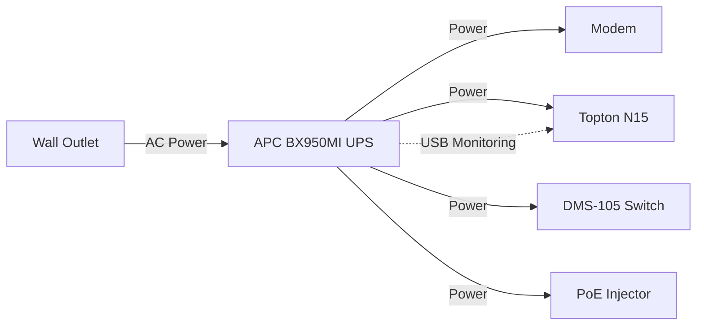
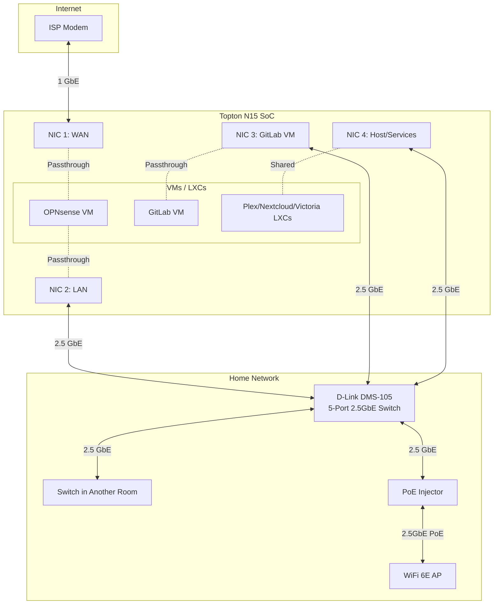
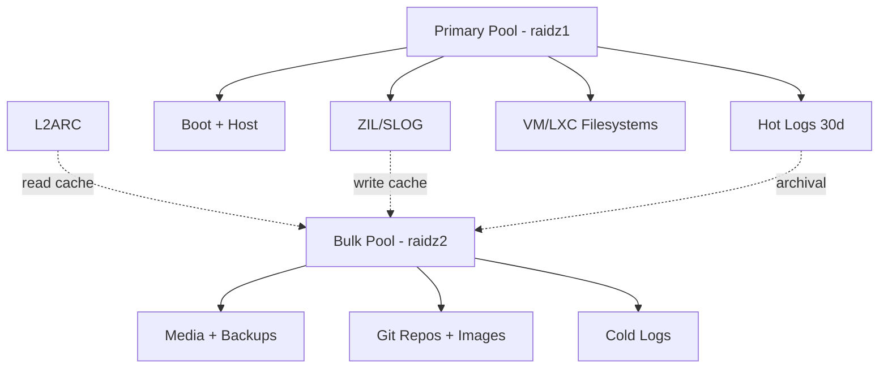
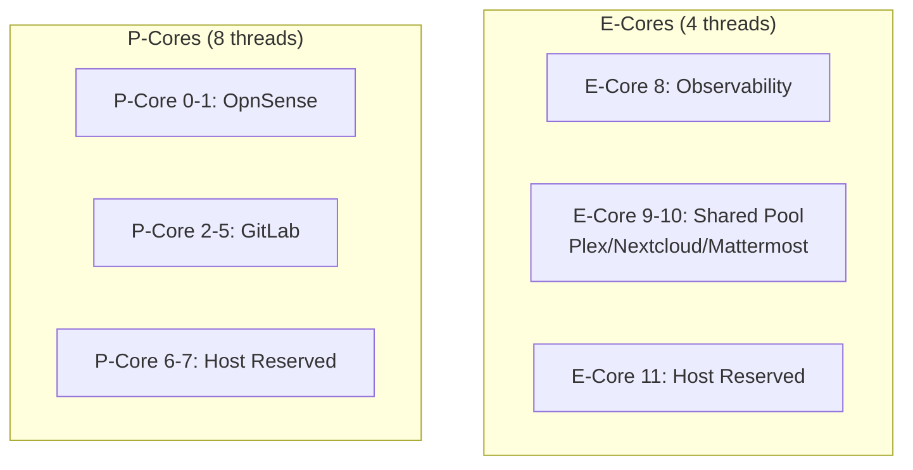
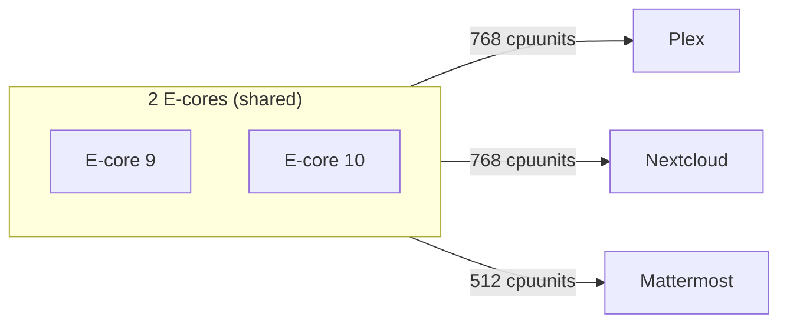

This is the first in a three-part series about upgrading my consumer-grade home NAS into a semi-enterprise private cloud. While this project runs in my living room, the principles behind it mirror the decisions businesses and CTOs face when scaling infrastructure:

- **Requirements drive architecture** — not the other way around
- **Constraints breed creativity** — limitations force optimal solutions
- **Reliability is designed-in** — expensive parts don't replace smart architecture
- **Pragmatism beats perfection** — knowing which compromises are acceptable

In this post, I'll walk through my reasoning and hardware selection. **Part 2** will cover the physical build process, and **Part 3** will detail the software configuration and performance testing.

If you're a **business owner** seeking someone who understands both software and infrastructure, or a **CTO** needing experienced external support for your team, these same principles apply at any scale.

---

## Why Upgrade?

My current setup has served me well: a [Topton SoC with an Intel Celeron N5105](https://www.toptonpc.com/product/n5105-nas-motherboard-mini-itx-industrial-17x17cm-soft-routing-intel-i226-2-5gbps-4lan-2m-2-nvme-6sata3-0-hdmi2-0-dp), 32GB RAM, and a mix of HDDs and SSDs running Proxmox VE. It handles basic routing, NAS duties, and services like Plex with transcoding, Nextcloud, and AdGuard without breaking a sweat.

However, as I transition back to full-time freelancing—balancing client work with personal projects and continuous learning—I need more than "good enough." I need:

- **Compute power** for GitLab CI/CD pipelines and modern observability tools
- **Security** through IDS/IPS capabilities with Suricata
- **Reliability** via redundant storage for critical systems
- **A secure image registry** for container deployments
- **Data integrity** with ECC-capable memory
- **Professional-grade monitoring** to catch issues before they become problems

## Design Constraints

Since this infrastructure lives in my home rather than a data center, I've set practical boundaries:

**Location & Environment**
- Must operate in the living room near my modem
- No dedicated cooling beyond existing HVAC
- Noise levels suitable for a living space

**Power Budget**
- Baseline operation: under 40W (routing and monitoring)
- Peak load: under 100W (all services active)
- CPU TDP: 50W maximum
- Backed by an APC UPS supporting modem, NAS, and WiFi 6E AP

**Financial Constraints**
- System build (excluding storage): under 1'000 CHF
- Leverage existing 2.5GbE infrastructure
- Reuse proven components (PSU and case)

**Technical Requirements**
- DDR5 platform for on-die ECC (a pragmatic middle ground between consumer DDR4 and expensive RDIMM platforms)
- Redundancy for OS and critical storage
- Maintain compatibility with existing Fractal Node 304 case

## The Hardware Solution

After evaluating various options, here's what I selected:

### About That "Wooden Cloud"
- Fractal Design Node 304 case (retained and modified)
- Xilence I404T CPU cooler with be quiet! 92mm fan

Here's the fun part: I've wrapped my Fractal Design Node 304 Case in white faux-wood vinyl. Since the side vents aren't necessary with my power target and cooling design, I've noise-isolated them, and the foil gives the case a furniture-like appearance. It sits in my living room looking like a decorative piece rather than a server. The top-down CPU cooler from Xilence will provide a bit of airflow over otherwise-shielded components.

{: class="content-img" alt="The Fractal Node 304 with white faux-wood vinyl wrap, photographed on my balcony in the swiss mountains."}

### Core Components (~700 CHF)

**Processing & Memory**
- [Topton NAS SoC with Intel i5-12450H](https://www.toptonpc.com/product/i5-12450h-6-bay-nas-motherboard-8505-max-6nvme-6sata3-0-1pciex4-4intel-i226-v-2-5g-2ddr5-firewall-pc-mini-itx-mainboard) (4P+4E cores, 45W PL1)
- 96GB DDR5-5600 (2× 48GB Crucial SO-DIMMs)

The 12th-gen i5 provides an excellent balance: four performance cores with hyperthreading for demanding tasks, plus four efficiency cores for less demanding services. I'll limit package power to 45W initially (this CPU can burst up to its PL2 of 95W), potentially lowering it to ~30W after testing with Suricata IDS.

**Power**
- APC BX950MI 950VA/520W UPS, provides 15-30 minutes backup
- Seasonic PRIME 600 Titanium Fanless PSU (retained from previous build)

The APC UPS protects the modem, server, network switch, and PoE injector (with it the WiFi 6E AP) from power interruptions. With USB monitoring connected to the server, it triggers an automatic graceful shutdown before battery depletion. This partnership with the power-loss-protected Micron SSDs ensures data integrity—even without ECC RAM, the combination of UPS automated shutdown and PLP prevents corruption from unexpected power loss.

The Seasonic unit remains one of the finest PSUs ever manufactured—still relevant despite its 2019 vintage. Its fanless design contributes zero noise to the system, while the Titanium efficiency rating (94%+ across the load range) minimizes heat output and power waste.

{: class="content-img" alt="Seasonic's Flagship Prime 600 Titanium Fanless"}

**Networking**
- 4× 2.5GbE Intel i226-V NICs (integrated on the SoC)
- D-Link DMS-105 5-Port 2.5GbE Unmanaged Switch

The board integrates 4x 2.5GbE ports using Intel i226-V NICs, similar to my previous Topton SoC from 2021. Two ports (WAN/LAN) pass through to the OPNsense VM, one to the GitLab VM, and the fourth is shared between the host and remaining services.

The i226-V and its predecessor i225-V are notoriously buggy. Disabling Energy Efficient Ethernet (EEE) and Active State Power Management (ASPM) usually resolves stability issues, but if problems persist, I'll fall back to VirtIO passthrough instead of hardware passthrough.

The D-Link switch connects to a switch in another room and the PoE converter for the WiFi 6E AP. It's compact and power-efficient, fitting well into this low-power build.

**Connectivity & Adapters**
- 2× U.2 adapters (PCIe x4, M.2 x4 to SFF-8643)
- 3× SFF-8643 to U.2 cables (with SATA power)
- 2× PCI low-profile brackets for 2.5" drive mounting
- Miscellaneous brackets and cables

The board provides one SFF-8643 connector at PCIe 3.0 x4. To connect all three U.2 drives, I'm adding two more SFF-8643 connectors using a PCIe x4-to-SFF adapter and an M.2-to-SFF adapter in the PCIe 4.0 x4 slot and M.2 PCIe 4.0 x4 slot respectively.

Although two drives could run at Gen4 speeds, I'll force all lanes down to PCIe 3.0 in the BIOS to ensure uniform performance across the raidz1 array. PCIe 3.0 x4 provides ~3.5 GB/s per drive, which is more than sufficient for this workload.

### Storage Configuration (~1'400 CHF)

**Primary Storage (ZFS raidz1)**
- 3× Micron 7400 Pro 960GB Gen4 U.3 SSDs (7mm, 1 DWPD)

These enterprise drives bring power-loss protection (PLP), consistent performance, and remarkable reliability. I found them on sale and purchased four units (one spare). While not matching consumer SSD peak speeds, their predictability and endurance are exactly what critical storage requires. The 1 DWPD (Drive Writes Per Day) rating represents the endurance for 4K random writes—the demanding access pattern these drives will face handling VM filesystems, ZIL writes, and application state.

I'll run these at PCIe 3.0 rather than 4.0—the SoC's onboard SFF-8643 connector limits one drive to PCIe 3.0 speeds anyway, and running all three at the same speed avoids potential bottlenecks. The reduced power consumption also helps meet my thermal budget. With raidz1, this array can survive one drive failure while maintaining data integrity.

**Bulk Storage (ZFS raidz2)**
- 6× WD Red Plus 8TB HDDs

The raidz2 configuration provides dual-parity protection, allowing up to two simultaneous drive failures without data loss—essential for this many large drives in a single array. The WD Red Plus 8TB models spin at 5640 RPM rather than the typical 7200 RPM, making them relatively quiet and power-efficient (~3.5W idle, ~6W during read/write). While not top performers, they align perfectly with my acoustic and power targets for a living room deployment.

**L2ARC Cache**
- 1× Samsung 970 Pro 1TB (MLC, 98% health remaining)

My trusty 970 Pro shows just 2% wear after years of service. Rather than risk it for critical data, I'm repurposing it as L2ARC for the HDD pool—perfect for accelerating Git repository access and frequently-read smaller files. L2ARC is a read-only cache, so drive failure only affects performance, not data integrity. Even plugged into the remaining PCIe 3.0 x1 slot (significantly limiting bandwidth), it's still far faster than the bulk HDD pool for small file delivery.

### Physical Integration

Mounting three U.2 drives in the Node 304 requires creativity. I will be drilling mounting points in the upper support frame to install PCI low-profile brackets, each holding two 2.5" drives. This positions them in the airflow path while maintaining the case's compact footprint.

## Software Architecture

### Proxmox VE Host

The foundation runs Proxmox VE with ZFS managing redundant storage arrays and scheduled scrubbing.

### OpnSense Firewall (VM)
- 2 pinned vCPUs (1 P-core with both threads)
- 18GB RAM
- Services: Suricata IDS, CrowdSec, pfBlockerNG-devel with MaxMind GeoIP, Unbound DNS with DoH, Netdata

The security stack provides comprehensive network protection, with Suricata IDS monitoring traffic patterns and CrowdSec providing collaborative threat intelligence. This hardened perimeter is particularly crucial for protecting exposed services—Git repositories, the GitLab container registry, Nextcloud file storage, and all data residing on the raidz2 pool. The generous RAM allocation provides headroom for the combined memory footprint of Unbound's DNS cache, pfBlockerNG's GeoIP databases, CrowdSec's decision engine, and Netdata's metrics collection.

### GitLab Instance (VM)
- 4 pinned vCPUs (2 P-cores with 4 threads total)
- 18GB RAM
- GitLab CE with 2-3 concurrent executors and integrated container registry

The GitLab instance serves as the development hub, providing Git repository hosting, CI/CD pipelines, and a private container image registry. Both Git repositories and container images are stored on the raidz2 HDD pool—a deliberate choice prioritizing data redundancy and capacity over raw speed.

While HDDs are slower than SSDs, ZFS's caching architecture largely mitigates this for Git operations: the 2GB ZIL on enterprise SSDs accelerates synchronous writes, ARC (leveraging the host's 48GB RAM) caches frequently-accessed data in memory, and the 970 Pro's 1TB L2ARC provides a second cache tier. Git repositories, with their many small files and frequent read patterns, benefit significantly from this multi-tiered caching strategy. Container images, being larger sequential reads during pulls, perform acceptably even on HDDs.

### Observability Stack (LXC)
- 1 vCPU (1 pinned E-core)
- 6GB RAM
- VictoriaMetrics and VictoriaLogs aggregating metrics and logs from all systems

Metrics will be retained on the raidz1 array for 4 weeks before truncation, while logs follow a tiered storage approach: hot logs remain on the fast raidz1 array for 30 days, then a cron job migrates them to cold storage on the raidz2 HDD pool. VictoriaLogs' `vlselect` component maintains seamless query access across both hot and cold storage tiers through its UI.

### Application Services (LXCs)

These three services will share two E-cores using CPU pinning and proportional scheduling:

- **Plex** (2 cores, 768 cpuunits, 2GB RAM) with 12th-gen iGPU passthrough for transcoding
- **Nextcloud** (2 cores, 768 cpuunits, 2GB RAM)
- **Mattermost** (2 cores, 512 cpuunits, 2GB RAM)

All three LXCs will be pinned to the same two E-core logical CPUs via `lxc.cgroup2.cpuset.cpus`, with `cores: 2` set to match the pinned CPU count. The Linux CFS scheduler will distribute CPU time proportionally via `cpuunits` weights (768:768:512, equivalent to 0.75:0.75:0.5 shares). These services support a small user base where potential contention from shared CPU resources won't impact business operations in a meaningful way.

### Reserved Resources

This allocation leaves one P-core (two threads), one E-core, and 48GB RAM completely available for the Proxmox host and ZFS—ample headroom for system operations, ZFS scrubbing, and ARC caching.

## Trade-offs and Pragmatism

Every design involves compromises. Here are mine:

**Missing Features:**
- Hot-swap capability (traded for visuals, acoustics and budget)
- Redundant PSU (somewhat mitigated by using a high quality unit, and having a spare 500W unit on hand)
- Redundant WAN (could add a 5G USB modem as fallback, but my ISP runs its business well with >99.99% uptime)
- Full end-to-end ECC (DDR5 on-die ECC is the pragmatic middle ground)

**Gained Benefits:**
- Near-silent operation suitable for living spaces
- Furniture-like aesthetics
- Enterprise-grade storage reliability
- Professional monitoring and security capabilities
- Power efficiency enabling 24/7 operation

## Current Status

I've received most components, but due to a shipping issue with the SoC and me travelling for a few weeks, the final build is now projected for late November.

Part 2 will cover the physical build process and hardware integration. Part 3 will detail the software configuration and final performance testing.

**Are you facing similar challenges balancing high performance, efficiency, and budget in your own infrastructure? Interested in discussing your development needs?** *Feel free to reach out.*