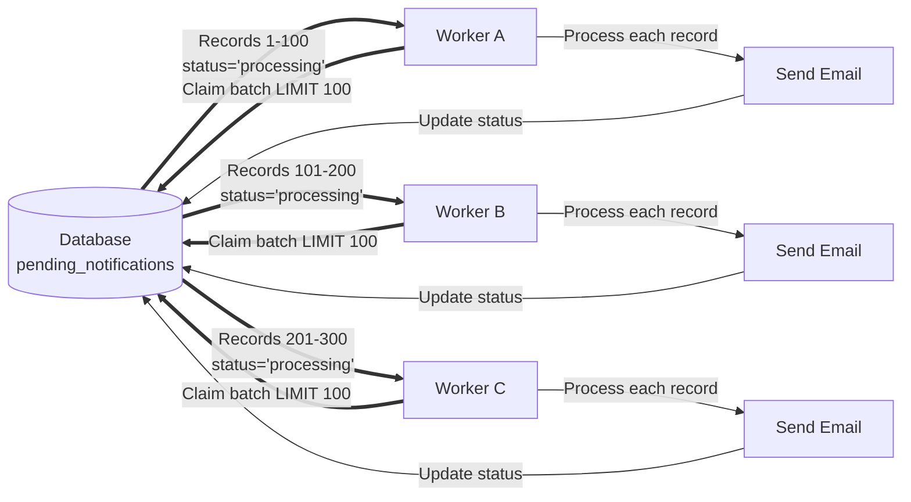

Every hour your engineers spend restarting cronjobs, clearing lockfiles, or investigating duplicate sends is time not spent on shipping new features. For most legacy stacks, this “background maintenance tax” costs dozens to hundreds of engineer-hours every year — and it's entirely avoidable.

This post examines these issues and presents a more robust solution using your database locking system as a lightweight queue manager, while avoiding the pitfalls that come with naive implementations. This approach won't give you Kafka-level guarantees, but it eliminates the most common concurrency and reliability issues—using nothing more than the database you already have.

## Real-world impact from a production refactoring

During my time working with a small PHP department, I encountered antipatterns that are still surprisingly common in modern systems—a critical mailer system running on a single container that regularly became unresponsive, generated SQL errors, and required manual intervention 2+ times per week. Each incident meant 30 minutes of engineer time plus customer complaints about delayed or duplicate notifications. Many teams maintain these patterns despite better approaches existing. This isn't a failure of individual developers—it's a systemic challenge where competing priorities and risk aversion create an environment where 'good enough to ship' becomes 'impossible to replace.' **This post shows you how to break that cycle—and do it in two weeks, not two months.**

**The Results After Implementation:**

- **Scaling unlocked:** 1 worker → 4 parallel workers (4× throughput capacity)
- **Memory usage:** 12GB+ (constant OOM issues) → <500MB per worker
- **Manual interventions:** ~4 hours/month → eliminated completely
- **Duplicate sends:** Regular complaints → eliminated completely
- **Delayed deliveries:** Regular escalations → none reported
- **Infrastructure cost:** No additional spend (same total resources, better utilized, leaving more memory to other workloads)

**Implementation time:** ~2 weeks including testing, documentation and gradual rollout

## Pattern Comparisons

**Business & Implementation Considerations**

| Factor |       Naive Cronjobs        |              DB Locking Pattern               |                Message Queues                |
|---------|:---------------------------:|:---------------------------------------------:|:--------------------------------------------:|
| Time to implement |             N/A             |             1-2 weeks per system              |                  1-3 months                  |
| Team expertise needed |       Basic scripting       |              SQL + transactions               |             Distributed systems              |
| Incremental adoption |              ❌              |              ✅ System-by-system               |       ⚠️ Often requires full migration       |
| Risk during rollout |   High (existing issues)    |            Low (parallel testing)             |        Medium (infrastructure change)        |
| Rollback if needed |             N/A             |               Easy (toggle off)               |       Complex (data/routing migration)       |
| Ongoing maintenance |    High (constant fires)    |           Low (mostly self-healing)           |         Medium (monitoring/scaling)          |
| TCO (2-year) | High (ongoing firefighting) | Low (one-time refactor + minimal maintenance) | High (infrastructure + operational overhead) |

**Technical Capabilities**

| Feature | Naive Cronjobs |    DB Locking Pattern    |  Message Queues  |
|---------|:--------------:|:------------------:|:----------------:|
| Concurrent workers |       ❌        |         ✅          |        ✅         |
| Horizontal scaling |       ❌        |         ✅          |        ✅         |
| Dead letter queues |       ❌        |    ⚠️ (manual)     |        ✅         |
| Delivery guarantees |       ❌        | ⚠️ (at-least-once) | ✅ (configurable) |
| Operational tooling |       ❌        |  ⚠️ (SQL queries)  |        ✅         |
| Infrastructure cost |      Low       |        Low         |       High       |

> **Warning**: what follows is a detailed technical deep dive, addressing antipatterns, database locking internals and how the solution works incl. handling of edge cases

## The Problem: Common Antipatterns in Legacy Cronjobs

### No Concurrency Control

The most dangerous pattern is having no concurrency control at all. Scripts simply loop through records and process them, with no mechanism to prevent multiple job instances from processing the same records simultaneously. This leads to duplicate notifications, skewed statistics, and wasted resources.

### Lockfiles

Teams use lockfiles to prevent concurrent execution, but lockfiles are fundamentally designed for single-instance execution—not distributed workloads. **The consequence**: You cannot horizontally scale at all. Adding a second container means both compete for the same work with no coordination, or you build complex shared-state mechanisms (tracking which container locked which record IDs) that are fragile and defeat the purpose of simple lockfiles. This pattern only makes sense for jobs that must run exactly once, like syncing external data sources—not for processing queues that need to scale with demand.

Additionally, crashed scripts leave stale lockfiles that deadlock the job until manual cleanup, often discovered hours later when users report missing notifications. If you’re still using lockfiles in a containerized environment, you’ve hard-coded a single point of failure into every job run.

### Missing Error Handling

Even when lockfiles are used, I've seen implementations without proper try-catch blocks or shutdown handlers. This means an unhandled exception leaves the lockfile in place, effectively deadlocking the job until manual intervention.

### Arbitrary Batch Size Reductions

A common symptom of architectural problems is progressively reducing batch sizes to keep jobs within their scheduled window. A job that originally processed 1000 records per run gets reduced to 750, then 500, then 250 as the dataset grows. Rather than addressing the underlying issue (inability to scale horizontally or inefficient processing), teams work around it by limiting throughput. This creates a false sense of stability while the backlog grows and processing delays increase. The batch size becomes a band-aid hiding the fact that the job cannot scale to meet demand.

### ORM Memory Retention in Batch Processing

When using ORMs like Doctrine in batch processing loops, a subtle but critical issue emerges. ORMs usually maintain an identity map and unit of work that keeps references to all loaded entities. Even after processing a batch and unsetting variables, the ORM still holds these entities in memory.

Over thousands of iterations, this causes memory usage to grow until the script eventually hits the container's or host's RAM limit. This doesn't always result in an immediate crash; often, the process simply becomes unresponsive, stops processing, and in the best case is eventually killed by the container orchestrator (e.g., Kubernetes OOM killer). During this stall, the processing queue builds up silently, and the job effectively stops until manually restarted or the container is replaced. The typical response is reducing batch size, but this merely delays the problem rather than solving it.

### Missing Graceful Shutdown Handling

In containerized environments with rolling deployments, containers regularly receive SIGTERM signals—yet most legacy scripts ignore these entirely. Without graceful shutdown handling:

- Lost work: Jobs killed mid-batch leave records stuck in "processing" state, requiring manual intervention or recovery jobs to fix
- Duplicate processing: Records not marked complete before shutdown get reprocessed, causing duplicate notifications or double-counted statistics
- Deployment friction: Teams set unreasonably long grace periods (5+ minutes) to avoid mid-batch kills, slowing deployments

## The Solution: Database-Level Row Locking

Modern relational databases provide native support for **explicit row-level locking** that addresses concurrency issues. The key is using `SELECT ... FOR UPDATE SKIP LOCKED` (SQL Server: `SELECT ... WITH (ROWLOCK, UPDLOCK, READPAST)`) combined with a status-based workflow that keeps transactions short. Think of it as politely waiting in line for a service (the database row). If someone else is currently being served (they hold the lock), instead of waiting, your worker immediately steps past them and serves the next available customer. This is what allows for true, non-blocking horizontal concurrency.

The code examples below are written in PHP because that was the environment of the real-world system I recently refactored. The underlying concepts, however, are completely language-agnostic — the same approach works just as well in Python (Django/Flask), C# (.NET), Go, Java, or any other stack backed by a relational database. Only the surrounding syntax changes; the pattern itself remains universal. For completeness, I’ve included SQL examples compatible with PostgreSQL, SQL Server, and MySQL/MariaDB (InnoDB). 



> Conceptually, this pattern turns your existing relational database into a lightweight queue manager. Each worker claims a slice of work atomically using row-level locks, processes it safely, and releases it — all without introducing new infrastructure. It’s the simplest reliable queue you can deploy today.

### Database locking differences

Each database implements row-level locking differently, which affects how this pattern performs:

- **PostgreSQL**: Uses tuple-level versioning as MVCC (Multi-Version Concurrency Control) by default, providing the cleanest implementation of this pattern. Locks remain at the row level unless manually escalated.
- **MySQL/MariaDB**: Implements MVCC through row versioning with undo logs, but locking operates at the index record level. In `REPEATABLE READ` isolation (the default), InnoDB uses next-key locks (record locks plus gap locks) when scanning index ranges, which can introduce unexpected lock contention if indexes are missing or suboptimal. Switching the session (or the entire database) to the `READ COMMITTED` isolation level is often recommended for job queue tables in MySQL/MariaDB to minimize lock contention from next-key (gap) locking.
- **SQL Server**: SQL Server uses pessimistic locking by default with automatic lock escalation. The Database Engine can escalate locks through multiple levels (row → page → table) or directly (row → table), depending on lock memory consumption and lock patterns. Escalation triggers when a statement acquires at least 5,000 locks on a single table or index partition, or when lock memory exceeds configured thresholds.This can be controlled per table via the `LOCK_ESCALATION` option if needed.

**Ordering guarantees**: While the queries use `ORDER BY created_at, id` to process records chronologically, `SKIP LOCKED`/`READPAST` does not guarantee strict FIFO ordering across concurrent workers. Workers skip locked rows and claim the next available unlocked batch, which means records inserted earlier might be processed after records inserted later if they're currently locked. This "approximate FIFO" behavior is acceptable for most queue-like workloads (notifications, background jobs) but unsuitable for use cases requiring strict ordering guarantees.

**Practical implication**: Test your implementation under realistic load to understand how your database handles lock contention. If you see unexpected blocking despite using `SKIP LOCKED`/`READPAST`, the culprit is usually a missing index or an isolation level mismatch.

### Critical Principle: Keep Transactions Short

The most important rule when using database locking for job processing is to never perform external I/O operations inside a transaction. Sending emails, making HTTP requests, writing files, or any other blocking operations while holding database locks will create the following problems:

- Connection pool exhaustion as workers hold connections during I/O wait
- Increased lock contention and reduced throughput
- Risk of deadlocks and timeout issues
- Database performance degradation

Instead, use a two-phase approach: claim records quickly, then process them outside the transaction.

### Further Important Caveats

**Indexing**: For this pattern to perform at scale, you must have an efficient index on the fields used for selection and ordering. A composite index on `(status, created_at, id)` is crucial. Without this, the `SELECT ... FOR UPDATE` will likely result in a full table scan, which can cause performance bottlenecks and lock contention despite using `SKIP LOCKED`.

**Graceful Shutdown**: Implement signal handling (SIGTERM/SIGINT) to finish the current batch before shutdown—critical for containerized deployments. This requires your script to run as the primary process (PID 1 or under a simple supervisor) in dedicated CLI-based containers; web server environments like PHP-FPM or uWSGI won't propagate signals to application code. Choose your update strategy: individual record updates maximize reliability (progress never lost, even on SIGKILL mid-batch) at the cost of more database round-trips, while batched updates are more efficient but risk reprocessing the entire batch if killed before completion. Ensure your orchestration platform provides sufficient grace period (30-60 seconds; in Kubernetes: `terminationGracePeriodSeconds`) between SIGTERM and SIGKILL.

**Edge Case Handling**: Implement recovery mechanisms for stuck records (workers that crash mid-processing) and failed records that need retry logic. A periodic recovery job should reset records stuck in "processing" status beyond a reasonable timeout (e.g., 30 minutes). For failures, add a `retry_count` column and implement backoff logic with maximum retry limits to prevent infinite loops. After max retries, records should remain in "failed" status for manual review or dead-letter handling.

**ORM Memory retention**: When using an ORM like Doctrine, clear the entity manager after each batch to prevent memory leaks from accumulated entities in the identity map. After clearing it, any previously fetched entities are detached, accessing them or related lazy-loaded associations will trigger errors.

**Connection exhaustion**: Long-running workers in connection pools risk exhausting available connections if not carefully managed. Consider: max_execution_time limits, connection timeouts, and implementing circuit breakers for external dependencies. Avoid persistent connections for long-running workers as they can become stale or maintain outdated connection state; use connection pooling at the process level or reconnect periodically to prevent stale sessions.

## Implementation: Two-Phase Processing

The implementation varies by database system. **PostgreSQL and SQL Server offer a more efficient single-query approach** using CTEs with `RETURNING` or `OUTPUT` clauses, while **MySQL requires a two-step process** with separate SELECT and UPDATE statements.

### PostgreSQL: Optimized Single-Query Claim

PostgreSQL's `UPDATE ... RETURNING` combined with CTEs allows atomic claiming in a single query:

```php
function claimNotificationBatch(PDO $pdo, int $batchSize = 100): array 
{
    $pdo->beginTransaction();
    
    try {
        $stmt = $pdo->prepare("
            WITH candidate AS (
                SELECT id
                FROM pending_notifications
                WHERE status = 'pending'
                ORDER BY created_at ASC, id
                LIMIT :limit
                FOR UPDATE SKIP LOCKED
            )
            UPDATE pending_notifications p
            SET status = 'processing', claimed_at = NOW()
            FROM candidate c
            WHERE p.id = c.id
            RETURNING p.id, p.user_id, p.message, p.created_at
        ");
        
        $stmt->bindValue(':limit', $batchSize, PDO::PARAM_INT);
        $stmt->execute();
        
        $notifications = $stmt->fetchAll(PDO::FETCH_ASSOC);
        
        $pdo->commit();
        
        return $notifications;
        
    } catch (Exception $e) {
        $pdo->rollBack();
        error_log("Failed to claim batch: " . $e->getMessage());
        throw $e;
    }
}
```

This approach is more efficient and reliable than the MySQL version because it:
- Eliminates the race condition window between SELECT and UPDATE
- Reduces transaction duration by combining operations
- Guarantees atomicity of the claim operation

### SQL Server: Using OUTPUT Clause

SQL Server provides similar functionality using `UPDATE ... OUTPUT`:

```php
function claimNotificationBatch(PDO $pdo, int $batchSize = 100): array 
{
    $pdo->beginTransaction();
    
    try {
        $stmt = $pdo->prepare("
            WITH cte AS (
                SELECT TOP (:limit) *
                FROM pending_notifications WITH (ROWLOCK, UPDLOCK, READPAST)
                WHERE status = 'pending'
                ORDER BY created_at, id
            )
            UPDATE cte
            SET status = 'processing', claimed_at = SYSUTCDATETIME()
            OUTPUT inserted.id, inserted.user_id, inserted.message, inserted.created_at
        ");
        
        $stmt->bindValue(':limit', $batchSize, PDO::PARAM_INT);
        $stmt->execute();
        
        $notifications = $stmt->fetchAll(PDO::FETCH_ASSOC);
        
        $pdo->commit();
        
        return $notifications;
        
    } catch (Exception $e) {
        $pdo->rollBack();
        error_log("Failed to claim batch: " . $e->getMessage());
        throw $e;
    }
}
```

> **Locking hints explained:**
> - **READPAST**: SQL Server's equivalent to PostgreSQL's SKIP LOCKED — skips rows currently locked by other transactions
> - **UPDLOCK**: Acquires update locks to reserve rows for modification, preventing lock conversion conflicts
> - **ROWLOCK**: Requests row-level locks rather than page or table locks (SQL Server may still escalate under memory pressure)

### MySQL and MariaDB: Two-Step Claim Process

MySQL and MariaDB require a two-step approach since neither supports `UPDATE ... RETURNING/OUTPUT`:

```php
function claimNotificationBatch(PDO $pdo, int $batchSize = 100): array 
{
    $pdo->beginTransaction();
    
    try {
        // Step 1: Select and lock a batch of pending records
        $stmt = $pdo->prepare("
            SELECT id, user_id, message, created_at
            FROM pending_notifications
            WHERE status = 'pending'
            ORDER BY created_at ASC, id
            LIMIT :limit
            FOR UPDATE SKIP LOCKED
        ");
        
        $stmt->bindValue(':limit', $batchSize, PDO::PARAM_INT);
        $stmt->execute();
        
        $notifications = $stmt->fetchAll(PDO::FETCH_ASSOC);
        
        if (empty($notifications)) {
            $pdo->rollBack();
            return [];
        }
        
        $ids = array_column($notifications, 'id');
        
        // Step 2: Mark as processing - this claims the records
        // Safe: $placeholders contains only '?' characters, no user input
        $placeholders = implode(',', array_fill(0, count($ids), '?'));
        $updateStmt = $pdo->prepare("
            UPDATE pending_notifications 
            SET status = 'processing', 
                claimed_at = NOW() 
            WHERE id IN ($placeholders)
        ");
        $updateStmt->execute($ids);
        
        $pdo->commit();
        
        return $notifications;
        
    } catch (Exception $e) {
        $pdo->rollBack();
        error_log("Failed to claim batch: " . $e->getMessage());
        throw $e;
    }
}
```

While this works reliably, the two-step process holds locks slightly longer than the PostgreSQL/SQL Server single-query approach. For most workloads, this difference is negligible, but high-throughput systems may benefit from PostgreSQL or SQL Server.

### Processing the Claimed Records

Once records are claimed, the processing logic is identical across all database systems.

> CRITICAL NOTE: The processing logic (e.g., sendNotification) must be idempotent to correctly handle the 'at-least-once' delivery guarantee.

```php
function processNotifications(array $notifications, PDO $pdo): void
{
    // OPTION 1: Individual updates (maximum reliability, graceful shutdown safe)
    // Ensures progress is never lost, even if container is killed mid-batch
    // Trade-off: More database round-trips
    foreach ($notifications as $notification) {
        try {
            sendNotification($notification);
            markAsComplete($pdo, [$notification['id']]);
        } catch (Exception $e) {
            error_log("Notification {$notification['id']} failed: " . $e->getMessage());
            markAsFailed($pdo, [$notification['id']]);
        }
    }
    
    // OPTION 2: Batched updates (better performance, requires full batch completion)
    // More efficient but risks reprocessing entire batch on unexpected shutdown
    // Use this when signal handling provides sufficient shutdown grace period
    /*
    $successful = [];
    $failed = [];
    
    foreach ($notifications as $notification) {
        try {
            sendNotification($notification);
            $successful[] = $notification['id'];
        } catch (Exception $e) {
            error_log("Notification {$notification['id']} failed: " . $e->getMessage());
            $failed[] = $notification['id'];
        }
    }
    
    if (!empty($successful)) {
        markAsComplete($pdo, $successful);
    }
    
    if (!empty($failed)) {
        markAsFailed($pdo, $failed);
    }
    */
}

function markAsComplete(PDO $pdo, array $ids): void
{
    $pdo->beginTransaction();
    try {
        // Safe: $placeholders contains only '?' characters, no user input
        $placeholders = implode(',', array_fill(0, count($ids), '?'));
        $stmt = $pdo->prepare("
            UPDATE pending_notifications 
            SET status = 'completed', 
                processed_at = NOW() 
            WHERE id IN ($placeholders)
        ");
        $stmt->execute($ids);
        $pdo->commit();
    } catch (Exception $e) {
        $pdo->rollBack();
        throw $e;
    }
}

function markAsFailed(PDO $pdo, array $ids): void
{
    $pdo->beginTransaction();
    try {
        // Safe: $placeholders contains only '?' characters, no user input
        $placeholders = implode(',', array_fill(0, count($ids), '?'));
        $stmt = $pdo->prepare("
            UPDATE pending_notifications 
            SET status = 'failed', 
                failed_at = NOW(),
                retry_count = retry_count + 1
            WHERE id IN ($placeholders)
        ");
        $stmt->execute($ids);
        $pdo->commit();
    } catch (Exception $e) {
        $pdo->rollBack();
        throw $e;
    }
}

function clearOrmIfNeeded($entityManager = null): void
{
    if ($entityManager !== null) {
        $entityManager->clear();
        gc_collect_cycles(); // Force garbage collection
    }
}

// Signal handling for graceful shutdown
$shouldStop = false;

function signalHandler(int $signal): void {
    global $shouldStop;
    $shouldStop = true;
    error_log("Received signal $signal, will stop after current batch");
}

// Register signal handlers for graceful shutdown
pcntl_signal(SIGTERM, 'signalHandler');
pcntl_signal(SIGINT, 'signalHandler');

// Main execution loop
while (!$shouldStop) {
    // Check for signals
    pcntl_signal_dispatch();
    
    if ($shouldStop) {
        error_log("Shutdown signal received, exiting gracefully");
        break;
    }

    $batch = claimNotificationBatch($pdo, 100);
    
    if (empty($batch)) {
        break;
    }
    
    processNotifications($batch, $pdo);
    
    // If using ORM, clear its unit of work and identity map after each batch
    // clearOrmIfNeeded($entityManager);
    
    // Check for signals after processing batch
    pcntl_signal_dispatch();
}
```

### Why This Pattern Works

**Short Transactions**: The claim operation takes milliseconds. Database locks are held only long enough to read and update the status field.

**No I/O in Transactions**: All external calls happen after the transaction commits, so connection pool resources are not held during slow operations.

**Status-Based Workflow**: Records progress through states (pending → processing → completed/failed), making the system observable and debuggable.

**Failure Handling**: If a worker crashes after claiming but before completing, records remain in "processing" state and can be reclaimed by a separate recovery job.

**Concurrent Safe**: Multiple workers claim different records automatically through `SKIP LOCKED` (or `READPAST`), enabling horizontal scaling.

This is why a small, focused refactor done by experienced engineers often outperforms a full rewrite — you get reliability without introducing new complexity.

## Database Compatibility

This pattern works with most modern relational databases, with varying levels of optimization:

- **PostgreSQL 9.5+**: Full support with atomic single-query claiming via `UPDATE ... RETURNING`
- **SQL Server 2005+**: Full support with atomic single-query claiming via `UPDATE ... OUTPUT`
- **MySQL 8.0+**: Full support for `FOR UPDATE SKIP LOCKED` but requires two-step claiming process (no `UPDATE ... RETURNING` clause)
- **MariaDB 10.6+**: Full support for `FOR UPDATE SKIP LOCKED` but requires two-step claiming process (no `UPDATE ... RETURNING` clause)

## Conclusion

The key insight is that the database is already a robust coordination system. Rather than building external locking mechanisms or immediately jumping to message queue infrastructure, leveraging built-in database features often provides the right balance of simplicity and capability for evolving legacy systems.

This pattern works well for the common case of legacy cronjobs processing thousands to hundreds of thousands of records per hour. When you need to process hundreds of thousands per *minute*, have complex cross-service dependencies, or require sub-second latency, dedicated message queue infrastructure (RabbitMQ, Kafka, SQS) becomes necessary. But for most teams fighting unreliable cronjobs, this is a pragmatic, production-ready approach that delivers the reliability and concurrency benefits of message queues while requiring zero new infrastructure—perfect for teams that need improvements today without months of architectural rewrites.

> If your systems still rely on fragile cronjobs, you don’t need a Kafka cluster to fix reliability. A well-designed database-backed approach can deliver 80% of the benefits with 20% of the effort. I help engineering teams modernize these systems with minimal disruption — from pragmatic database-backed queues to full event-driven architectures when the time is right.

→ Ready to stabilize your legacy jobs? [Contact me for a consultation](/)