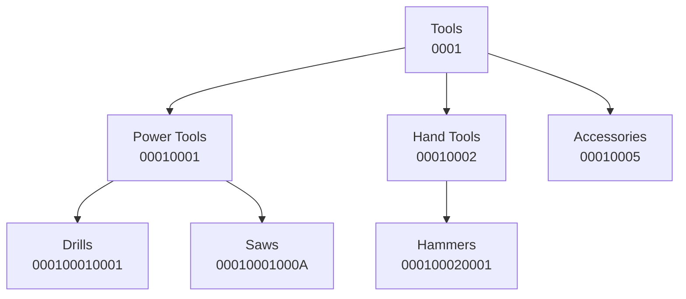
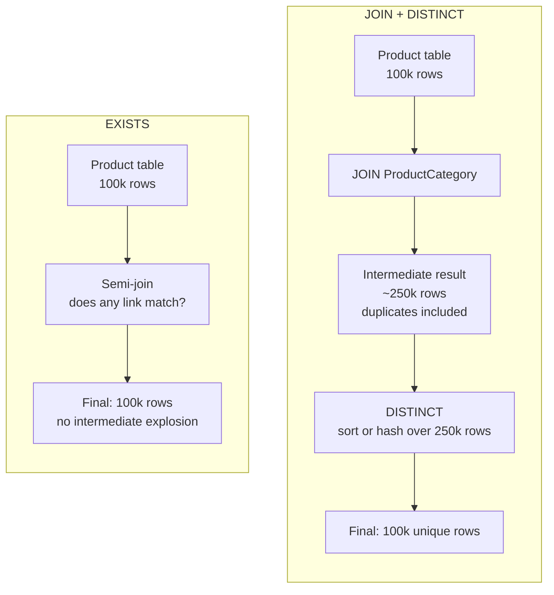

The **[overview article]()** covers how three patterns fit together for a read-heavy multi-site catalogue; this one goes deep on the category tree.

Materialized paths are not a Django pattern. The technique predates Django by decades and sits alongside adjacency lists, nested sets, and closure tables in Joe Celko's *Trees and Hierarchies in SQL for Smarties*, which remains the canonical reference on storing trees in SQL. What follows uses django-treebeard on Postgres for the implementation, but the pattern itself is portable to any SQL database and any ORM — the gotchas that take up most of this article are at the database layer, not the framework layer.

## The Problem with the Naive Tree

The obvious data model for a category tree is a self-referential foreign key — each row has a `parent_id` pointing to its parent. It models the domain accurately and requires no explanation. The problem shows up at query time.

"All products under Power Tools and its descendants" is a subtree query. With a parent-pointer model, you have two options. The first is a recursive CTE:

```sql
WITH RECURSIVE subtree AS (
    SELECT id FROM category WHERE id = %s
    UNION ALL
    SELECT c.id FROM category c
    JOIN subtree s ON c.parent_id = s.id
)
SELECT * FROM product
WHERE category_id IN (SELECT id FROM subtree);
```

Recursive CTEs are supported by Postgres, SQL Server, and recent MySQL and MariaDB, but most ORMs do not express them cleanly. Django's ORM has no native recursive CTE support; you drop to raw SQL or reach for a library. The second option is repeated queries — fetch the children, then the children's children, and so on until you hit leaf nodes. That is an N+1 problem shaped like a tree.

For browsing-dominant catalogues where subtree queries run on every page load, neither is the right tradeoff.

## The Pattern

Materialized paths store each node's full ancestry as a string on the row itself. Treebeard does this with **fixed-width segments and no separator** — every step is exactly `steplen` characters wide (default 4), drawn from the `alphabet` attribute (default `"0123456789ABCDEFGHIJKLMNOPQRSTUVWXYZ"`, a base-36 set). Each segment encodes a node's position among its siblings as a base-36 number, left-padded with zeros.



Reading `Saws` at `00010001000A` from left to right: `0001` (Tools is root #1), `0001` (Power Tools is the first child of Tools), `000A` (Saws is at position 10 under Power Tools — `A` is 10 in base-36). The same chunk-by-`steplen` rule applies to every path. There is no `/` between segments — `Drills` is literally the string `000100010001`, twelve characters long. `Q`, `X`, `Z` and the rest of the uppercase letters all appear in real paths once any sibling group has more than nine members, or once gaps from moves and deletes push later siblings into the letter range.

The non-contiguous positions (`Accessories` at `00010005`, `Saws` at `00010001000A`) are not a mistake. Treebeard leaves gaps in the sibling sequence after moves and deletes, which is covered in "How treebeard handles this internally" further down. Holes are inert at query time and visible only when you read paths directly.

Descendants of any node become a prefix match on the path string:

```sql
WHERE path LIKE '00010001%'
```

That returns `Drills` and `Saws` — every node under `Power Tools`. The absence of a separator does not change prefix-match semantics; the planner sees one continuous string.

On Postgres, left-anchored prefix matches use B-tree indexes efficiently — the planner treats `LIKE 'prefix%'` as a range scan between `prefix` and `prefix\xFF`. The subtree query requires no recursion, no joins across multiple queries, and no application-layer tree walking.

Depth does not change the *shape* of the query — it remains a single prefix range scan no matter how deep the tree goes, so the asymptotic complexity is the same at depth 3 and depth 30. In practice, deeper trees produce longer paths, which means wider index entries, lower B-tree fanout, and reduced cache locality on the hot pages. With treebeard's default 4-char steps, this is negligible up to a dozen levels and worth measuring around twenty. It is a linear physical cost on top of an asymptotically flat operation, not a hidden scaling cliff.

There is a hard tradeoff between max siblings and max depth. With `steplen=4` and the default base-36 alphabet, one parent can hold up to 36⁴ − 1 = 1,679,615 children, and the default `path` field's `max_length=255` allows a tree depth of 63 (255 ÷ 4, rounded down). Raising `steplen` to 5 lifts the sibling cap to over 60 million but drops max depth to 51 — and a parent with that many siblings usually signals a modeling problem worth fixing before reaching for `steplen`. The `alphabet` itself is configurable too; some teams swap in lowercase letters or printable ASCII to encode more children per character, but the base-36 default is the safe choice for cross-database collation behavior.

## What Subtree Moves Actually Cost

The read-side win is real. The write-side cost compounds from two independent sources, and it is worth understanding both before committing to the pattern.

Every move has a **dragging cost** and a **displacement cost**. The dragging cost comes from rewriting the path of the moved node and every one of its descendants. The displacement cost comes from any siblings at the destination that need to be pushed aside to make room, along with their descendants. These compound independently — a large subtree moved into an empty parent pays only the dragging cost; a small subtree moved ahead of a crowded sibling group pays primarily the displacement cost; the worst case pays both.

There is no move in this pattern that touches only a single row. Even the simplest structural change — attaching a leaf to a new parent with no siblings at the destination — still updates `numchild` on both the old parent and the new parent. Add a single displaced sibling with a subtree of its own and you are now touching three groups of rows across at least four UPDATE statements.

### How treebeard handles this internally

treebeard's core move primitive is `set_newpath_in_branches`: a single `UPDATE WHERE path STARTSWITH oldpath` that rewrites every row in a branch using string concatenation on the path column. One SQL statement per branch operation — efficient in round-trips, but wide in row locks.

Sibling displacement does not collapse into a single statement. treebeard iterates through each sibling that needs shifting and calls `set_newpath_in_branches` separately. Five displaced siblings — each with their own subtrees — produce five UPDATE statements, each locking a different slice of the table.

The less obvious case is a move left among siblings at the same level, where the destination path is numerically lower than the current path. treebeard cannot simply write the new path directly, because the target position is already occupied. It resolves this by first parking the node at a temporary position at the end of the sibling list, then shifting the displaced siblings into their new positions, then moving the node from the temporary path to its final destination. A reorder within the same parent can therefore produce up to three `set_newpath_in_branches` calls for the moved node alone, before the sibling displacement work is counted.

One deliberate behavior worth knowing about: treebeard does not compact the sibling sequence after moves or deletes. It shifts only the siblings that are actually in the way and leaves gaps everywhere else. This is intentional — holes do not affect query performance, and not renumbering the full sibling list keeps the write cost proportional to the actual displacement rather than the total sibling count. Gaps accumulate over time with heavy reorganization. If you ever need to inspect paths directly or care about the cosmetic cleanliness of the sequence, `fix_tree(fix_paths=True)` rebuilds it, though it is slower than the default `fix_tree()` which only corrects depth and `numchild` counters.

### Physical Consequences of Wide Updates

These are not Postgres-specific problems. Any relational database doing a large number of row updates within a transaction will face the same three categories of consequence: lock pressure, write amplification, and replication lag. What varies between engines is the specific mechanism and how much headroom you have before it becomes operational. On Postgres:

* **Lock amplification.** Each UPDATE holds row locks on every affected row for the duration of the transaction. Concurrent reads are fine under MVCC, but concurrent writes to those same rows — a background job updating `is_visible`, an import script touching category metadata — block until the move commits. A move that displaces several sibling subtrees can hold locks across a surprisingly wide slice of the table. SQL Server's lock escalation behaviour (row → page → table) makes this particularly aggressive without explicit `ROWLOCK` hints; MySQL's gap locking under `REPEATABLE READ` adds its own surprises on index ranges.
* **Write amplification and bloat.** Postgres writes new row versions rather than overwriting in place, so every row touched by a move produces a dead tuple that autovacuum must reclaim. For trees that reorganize frequently, autovacuum runs more aggressively, holds its own locks, and can fall behind during traffic spikes — at which point table and index bloat start compounding. `pg_stat_user_tables` and `pgstattuple` are the diagnostic tools when you suspect this. Other engines handle this differently (SQL Server's version store, MySQL's undo log) but the underlying pressure — more writes producing more cleanup work — is the same.
* **WAL amplification and replication lag.** Every row update generates WAL records, and every index that includes `path` gets a new leaf entry per row rather than benefiting from Postgres's HOT update optimization. Streaming replicas apply WAL serially; a move touching many rows can push lag from milliseconds into seconds, which breaks read-after-write expectations on read replicas and affects any CDC consumers downstream. The equivalent on SQL Server is log shipping lag; on MySQL it is binlog replay delay.

### Mitigations

In rough order of effort:

- **Schedule large reorganizations during low-traffic windows.** The simplest answer, and usually sufficient for catalogues that restructure rarely.
- **Constrain admin tooling during business hours.** Surface a warning in the UI when the selected node has more than N descendants, or when the target position has heavily populated siblings.
- **Set a statement timeout** on the connection performing the move, so a runaway operation fails fast rather than holding locks indefinitely.
- **Tune autovacuum per table** if frequent reorganizations are unavoidable — lower `autovacuum_vacuum_scale_factor` for the category table so dead tuples are reclaimed sooner rather than accumulating.

The shape of the tradeoff is: materialized paths optimize the read path, and every structural change is the price. For catalogues where the tree is mostly stable and browsing dominates traffic, that is the right shape. For systems where the hierarchy changes constantly, a closure table or a flatter taxonomy will serve better.

## The Django Model

```python
from treebeard.mp_tree import MP_Node
from django.contrib.sites.models import Site
from django.db import models
from django.db.models import UniqueConstraint, Index


class Category(MP_Node):
    site = models.ForeignKey(Site, on_delete=models.CASCADE)
    site_rank = models.IntegerField(default=0)
    name = models.CharField(max_length=255)
    slug = models.SlugField(max_length=255)
    is_visible = models.BooleanField(default=True)

    node_order_by = ["site_id", "site_rank", "name"]

    objects = models.Manager()
    on_site = CurrentSiteManager()

    class Meta:
        constraints = [
            UniqueConstraint(
                fields=["site", "slug"],
                name="unique_category_slug_per_site",
            ),
        ]
        indexes = [
            Index(
                fields=["site", "is_visible", "path"],
                name="category_subtree_lookup",
                opclasses=["", "", "varchar_pattern_ops"],
            ),
            Index(
                fields=["site", "is_visible", "slug"],
                name="category_slug_lookup",
            ),
        ]
```

Four details worth calling out.

**`node_order_by`** tells treebeard to handle node placement based on the listed fields. Leading with `site_id` clusters all roots and siblings for a given site at insertion time, keeping subtree paths contiguous and reinforcing what the leading index column does. `site_rank` is the manual ordering hook within a site; `name` is the deterministic tiebreaker. Once set, treebeard owns placement — calls like `add_sibling(pos="left")` are rejected, since there is no stable "left" outside the declared ordering.

**The unique constraint on `(site, slug)`** allows the same slug across sites: `shop.example.com/category/tools` and `b2b.example.com/category/tools` coexist with completely different content. It also means `is_visible=False` works as a soft delete — the row stays, the slug slot stays reserved, and a sibling cannot reclaim it to create canonical URL collisions. If your URL scheme includes the category ID, hidden categories remain addressable, external links keep resolving, and undelete is one field flip.

**The composite index `(site, is_visible, path)`** supports the subtree query. Column order matters: `site_id` cuts the row count immediately, `is_visible` narrows further, `path` carries the prefix match. Postgres can satisfy `WHERE site_id = 1 AND is_visible = true AND path LIKE '00010001%'` against this index, often skipping large heap scans entirely.

**The `opclasses` argument** is a Postgres-specific necessity. Outside the `C` locale, Postgres B-trees on text columns use locale-aware comparison rather than strict byte order — which prevents the planner from using them for `LIKE 'prefix%'` matches. `varchar_pattern_ops` forces byte-wise comparison and restores the prefix-match optimization. The two empty strings mean "use the default opclass" for `site_id` and `is_visible` — integer and boolean columns where the default is correct. Without the opclass override on `path`, the composite index above gets skipped by the planner for the exact query it was built to serve, and treebeard's own `db_index=True` on the `path` field has the same problem at the field level. The "PostgreSQL Deployment Notes" section at the end covers verification and other operational details.

## Working with the Tree

treebeard manages `path`, `depth`, and `numchild` itself. Creating categories through Django's normal `objects.create()` or `bulk_create()` will not populate them — the row inserts, the tree state is wrong, and path-walking queries return nothing or wrong results without raising any error. Every structural change goes through treebeard's API:

```python
# Roots and children
tools = Category.add_root(site=site_1, name="Tools", slug="tools")
power_tools = tools.add_child(site=site_1, name="Power Tools", slug="power-tools")
drills = power_tools.add_child(site=site_1, name="Drills", slug="drills")

# Siblings — position is determined by node_order_by
hand_tools = tools.add_sibling(site=site_1, name="Hand Tools", slug="hand-tools")

# Moving a subtree rewrites the path of the moved node and every descendant
drills.move(hand_tools, pos="sorted-child")
```

For bulk loads — seed data, fixtures, migrating a tree from another system — `load_bulk` takes nested dicts and builds the tree in the correct order. When the API gets bypassed, two recovery hooks help: `Category.find_problems()` reports nodes with path issues, wrong depths, or stale `numchild` counters, and `Category.fix_tree()` rebuilds tree metadata from existing path strings. `find_problems()` is cheap enough to run as a periodic sanity check or a CI assertion against fixture data.

**The failure mode worth naming explicitly:** a Django data migration that uses `Category.objects.create(...)` inside a `RunPython` block to seed categories will compile, run cleanly, and produce a tree where every node has `path=NULL`, `depth=NULL`, and `numchild=0`. Subtree queries return empty. The admin renders the tree as flat. The migration succeeds, the application starts, and the bug surfaces only when someone clicks "Power Tools" and sees no products. Always use `Category.add_root()`, `add_child()`, or `load_bulk` inside data migrations, and assert `Category.find_problems()` returns clean in CI.

## Querying Subtrees

The naive subtree query through the ORM:

```python
def products_in_subtree_naive(site_id: int, category_path: str):
    return Product.objects.filter(
        categories__site_id=site_id,
        categories__path__startswith=category_path,
        categories__is_visible=True,
        is_visible=True,
    )
```

This works and produces duplicates. A product that belongs to two categories within the same subtree appears twice. The reflex fix is `.distinct()`, but the problem is that `.distinct()` does not prevent the duplicates — it deduplicates them after the fact. Postgres typically implements it as a sort or hash over the join result, and on large joins that step can dominate query cost.



The better tool is `EXISTS`. A `JOIN + DISTINCT` produces row explosion and then deduplicates; `EXISTS` is a semi-join that asks "does any matching row exist for this product" — it never produces duplicates in the first place, and the planner can stop scanning as soon as it finds one match per outer row:

```python
from django.db.models import Exists, OuterRef

def products_in_subtree(site_id: int, category_path: str):
    matching_link = ProductCategory.objects.filter(
        product=OuterRef("pk"),
        category__site_id=site_id,
        category__path__startswith=category_path,
        category__is_visible=True,
    )
    return Product.objects.filter(
        is_visible=True,
    ).filter(Exists(matching_link))
```

The generated SQL becomes a semi-join (`WHERE EXISTS (...)`) and the planner does not need to deduplicate.

The gap between `EXISTS` and `DISTINCT` is narrower than it used to be. PostgreSQL 12+ decorrelates many `EXISTS` predicates into semi-join operators internally, and SQL Server does the same. The planner sometimes chooses parallel hash aggregation over a `DISTINCT` join that is competitive — particularly when join cardinality stays modest (few duplicates per outer row) or when the deduplicating step can be parallelized across cores. Prefer `EXISTS` first for many-to-many subtree membership: it expresses the intent directly, never produces an explosion to clean up, and gives the planner the cleanest shape to work with. If you have a `DISTINCT`-based query already in production and it performs well, run both plans on production-scale data with `EXPLAIN (ANALYZE, BUFFERS)` before rewriting — the right answer depends on cardinalities, available indexes, and which planner version is making the call.

The mental model still holds even when the runtimes converge: `EXISTS` describes the question you are actually asking; `DISTINCT` asks the planner to clean up an explosion that the query never needed to produce. Reach for `EXISTS` on many-to-many filters by default, and treat `.distinct()` showing up as a signal worth examining.

---

That covers the pattern end to end — from the encoding choice through the move mechanics, the Django model, and the query shape. The sections that follow address three questions that tend to come up once the above is working: how materialized paths compare to the alternatives if you are still evaluating, what Postgres-specific configuration affects the pattern in production, and whether `ltree` is worth considering if you are on Postgres exclusively.

## Choosing Between Tree Models

Materialized paths are one of four tree storage patterns that show up in production. Each one trades read cost against write cost differently:

| Model              | Subtree read                       | Move cost                              | Storage overhead          | ORM/query complexity              |
|--------------------|------------------------------------|----------------------------------------|---------------------------|-----------------------------------|
| Adjacency List     | Recursive CTE or N+1               | O(1) — update one FK                   | Minimal (one FK per row)  | High without library support      |
| Materialized Path  | Indexed prefix range scan          | O(descendants + displaced siblings)    | One path string per row   | Good (django-treebeard)           |
| Closure Table      | Indexed join on ancestry table     | O(descendants × ancestors) per move    | Up to O(n²) ancestry rows | Moderate; needs custom queries    |
| Nested Sets        | Indexed integer range scan         | O(n/2) average — renumber half the tree | Two integers per row      | Moderate; tricky to maintain      |

The pattern that fits depends on what your traffic actually does:

- **Adjacency list** wins when the application rarely fetches subtrees — administrative tools, settings hierarchies, anything walked one level at a time.
- **Materialized paths** win when subtree reads dominate and structural changes are infrequent or scheduled. Most product catalogues sit here.
- **Closure tables** are the answer for collaborative trees with constant reorganization — issue trackers with arbitrary nesting, org charts under active restructuring. The storage cost is real, but moves stay cheap because you maintain ancestry incrementally.
- **Nested sets** have the cheapest subtree reads of any model (a single `BETWEEN` on two integers), but inserting or moving a node renumbers roughly half the tree. They make sense for near-static hierarchies that are rebuilt rather than edited.

If your tree changes constantly, a closure table or a flatter taxonomy will serve you better than the pattern this article covers.

## PostgreSQL Specific Notes

### Postgres-specific alternative: `ltree`

The [`ltree`](https://www.postgresql.org/docs/current/ltree.html) contrib extension is purpose-built for hierarchical labels and ships with GIST indexes optimized for tree operations — ancestor, descendant, and pattern queries are all first-class operators rather than `LIKE` tricks. Text-encoded paths win on portability and ORM integration; `ltree` wins for complex tree queries on Postgres-only stacks where you already own the schema and your team is confident working with Postgres. The two approaches solve the same problem with different ergonomics.

### The `varchar_pattern_ops` Index Gotcha

Postgres B-trees order text columns according to the database's collation. Outside the `C` locale — and almost no production database runs in `C` — that ordering is locale-aware, which means it is not strict lexicographic byte order. The prefix-match optimization the planner uses for `LIKE 'prefix%'` requires byte-order semantics, so a default B-tree on a `varchar` or `text` column in a `en_US.UTF-8` (or similar) database **will not be used** for prefix matches. The query returns correct results; it just sequentially scans the table.

The fix is to declare the index with the `varchar_pattern_ops` opclass, which forces byte-wise comparison and re-enables the range-scan optimization regardless of locale. Treebeard ships its `path` field with `db_index=True`, which gives you Django's default index — the one that does not work for `LIKE` outside `C`. The composite index in the Django model above shows how to declare this explicitly through the `opclasses` argument.

You can verify the planner is using your index with `EXPLAIN (ANALYZE, BUFFERS) SELECT * FROM category WHERE path LIKE '00010001%'`. A `Bitmap Index Scan` or `Index Scan` confirms it. A `Seq Scan` on a non-trivial table is the signal that the opclass is wrong.

### ZFS Tuning for PostgreSQL

If your PostgreSQL data directory sits on a ZFS dataset, a few settings are worth adjusting from their defaults.

* `recordsize=8K` on the dataset holding `$PGDATA`. ZFS defaults to 128KB records; PostgreSQL's block size is 8KB. The mismatch means a single page write triggers a read-modify-write cycle under ZFS's copy-on-write semantics — the write that looked cheap at the PostgreSQL layer becomes a 128KB read plus a 128KB write. Every dead tuple a tree move produces hits this amplification once. Match `recordsize` to `block_size` (confirm with `SHOW block_size`) and the overhead disappears.
* `logbias=throughput` on the data directory, `logbias=latency` (the default) on the WAL dataset. PostgreSQL's WAL already provides crash recovery for the data directory; routing those writes through the ZIL as well adds latency with no additional durability. The WAL dataset keeps the default because PostgreSQL's fsync calls there need to reach stable storage before a commit acknowledgement goes to the client. **Safety caveat**: `logbias=throughput` bypasses the ZIL, so your pool's main write path must actually reach stable storage before reporting success. This holds when drives have power-loss protection or the pool is backed by a UPS with a SLOG device. On spinning disks with write-back cache and no protection, leave it at the default.
* `primarycache=metadata` on the data directory avoids double-buffering. PostgreSQL's `shared_buffers` already caches the hot working set; ARC caching the same blocks wastes memory that `shared_buffers` could use instead. If `shared_buffers` is intentionally small on a shared host, `primarycache=all` lets ARC fill the gap, but that is the exception.
* `wal_init_zero=off` and `wal_recycle=off` in `postgresql.conf`. Pre-zeroing WAL segments before use is unnecessary work on ZFS where compression handles sparse writes cleanly. Recycling reuses file inodes, but under ZFS's copy-on-write model new data always lands on new blocks regardless of whether you rename an existing file or create a new one — the filesystem-level benefit of recycling does not exist here, so there is no cost to disabling it. This is also Postgres official recommendation for any CoW filesystem.

---

*If you are working on a catalogue or any system where the data model and query patterns have drifted apart, [let's talk](/). I help engineering teams modernize backend architectures pragmatically.*