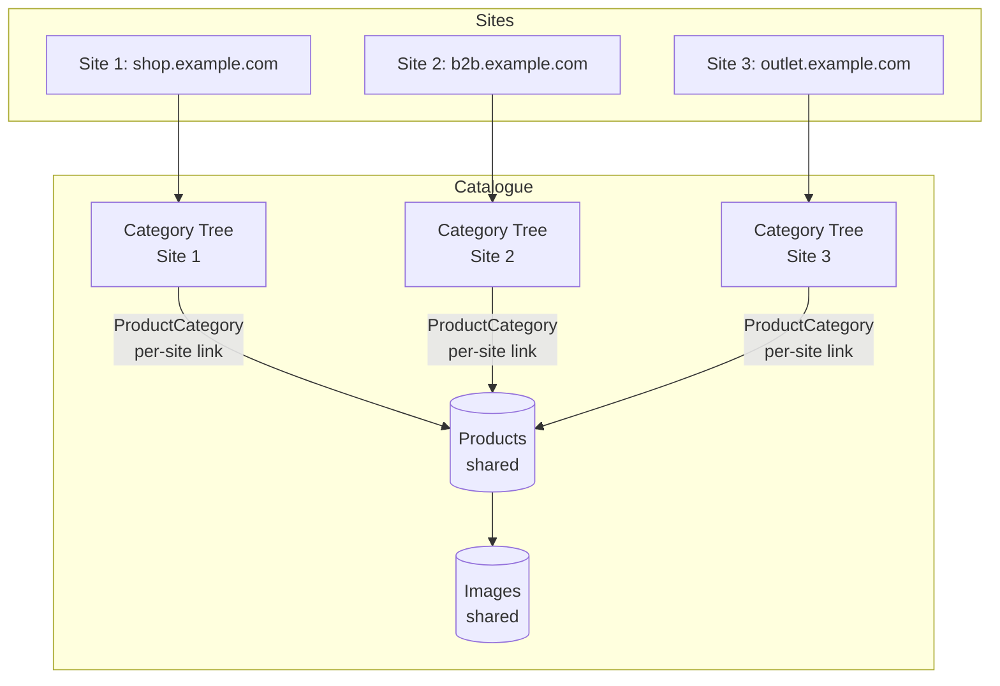

This post walks through three patterns that compose into a foundation for read-heavy shops serving multiple storefronts from a single application and database: **materialized paths** for the category tree, **discriminator-column partitioning** for per-storefront separation, and **correlated subqueries** for "one related thing per row" lookups. Each pattern addresses a specific failure mode; together they give you predictable query counts, cheap subtree reads, and multi-site separation without introducing new infrastructure. They are also portable — all three exist across most relational stacks, and the examples below use Django and Postgres, but the concepts translate directly.

This is not a universal solution. It fits well when the following constraints apply:

- You run multiple storefronts owned by the same business, sharing a product database, where shared infrastructure is the goal rather than true multi-tenancy with physical isolation between tenants.
- Your catalogue is in the range of dozens of categories per site, thousands to low millions of products, two to a few dozen sites, with traffic dominated by browsing rather than writes.
- Category tree restructuring is infrequent, or can be scheduled during low-traffic windows.
- **Operational simplicity is the priority.** Within these constraints, the patterns hold without additional infrastructure on several fronts. No caching layer is needed until traffic is significant enough to justify one — and caching multi-site responses introduces its own category of problems (there are only two hard problems in computer science, and cache invalidation is one of them). No second database to manage: everything lives in a single Postgres instance. No denormalized fields to maintain: primary image and primary category are derived at query time through correlated subqueries, so there are no `primary_image_id` columns on the product table, no import scripts that need to populate them correctly, and no triggers or application logic to keep them in sync when categories are reorganized.

The following are outside the scope of this article:

- **Full-text and faceted search.** The right answer depends on your scale and requirements — Postgres `tsvector` with a GIN index, JSONB attribute filtering, or a dedicated engine like Meilisearch or Typesense. Nothing here prevents adding any of these; they sit alongside the patterns, not inside them.
- **True multi-tenancy.** Discriminator-column partitioning is logical separation, not physical isolation. If tenants need independent backups, independent schema evolution, or contractual data isolation, look at `django-tenants` or schema-per-tenant instead.
- **Catalogue-scale partitioning.** At millions of per-site products or categories, you will need to consider table partitioning, read replicas, or sharding. The patterns here do not preclude those moves, but they stop being sufficient on their own.
- **Everything else a shop needs.** Pricing, recommendations, wishlists, cart, checkout — none of that is covered here.

> **A note on methodology:** every pattern, index, and query shape in this article is a starting point, not a prescription. Database planners are sensitive to row counts, statistics, index shapes, and version-specific behavior in ways no blog post can predict for your data. `EXPLAIN ANALYZE` (Postgres), `EXPLAIN ANALYZE FORMAT=TREE` (MySQL 8+), or the equivalent in your database is the canonical tool — it shows the actual plan, the actual row counts, and the actual time at each step. Django surfaces this during development through [django-debug-toolbar](https://django-debug-toolbar.readthedocs.io/). Treat everything below as a hypothesis to verify against your workload, not a rule to apply blindly.

## The Setup: Multiple Storefronts, One Database

About ten years ago I built a catalogue platform for a client running three storefronts from the same inventory. They share products, images, and suppliers. Categories are independent per storefront, some products appeared across all storefronts, others in only one. Slugs, ordering, visibility, and pricing are managed independently per storefront.



The shared bits — products, images, suppliers — live once. The per-site bits — category trees, slugs, ordering, visibility — are partitioned by `Site`. The three patterns (plus the access pattern matching indexes) below are what made that work without a second database, a caching layer, or denormalized fields on the product table.

## Materialized Paths for Category Trees

→ ***[The full article]()** covers move mechanics and their physical consequences in detail — lock amplification, write bloat, replication lag, and the mitigations worth considering at each level of restructuring frequency.*

The naive category tree is a self-referential foreign key — each row points to its parent. It models the structure cleanly but makes subtree queries painful: "all products under Power Tools and its descendants" requires either recursive CTEs or repeated round-trips to walk the tree. For browsing-dominant catalogues, that is the wrong tradeoff.

Materialized paths invert it. Each node stores its full path from the root as a fixed-width, separator-free string — treebeard uses base-36 segments, so `Drills` three levels deep looks like `000100010001`. Descendants become a prefix match: `WHERE path LIKE '00010001%'` returns everything under Power Tools. On Postgres, left-anchored prefix matches use B-tree indexes efficiently, making subtree reads cheap regardless of tree depth. The library that handles this in Django is [django-treebeard](https://django-treebeard.readthedocs.io/), which manages path generation, depth tracking, and sibling ordering automatically.

The cost is paid on writes. Moving a subtree rewrites every descendant's path column — a 10,000-node move produces 10,000 row updates, 10,000 dead tuples for autovacuum to reclaim, and proportional WAL volume that can push replication lag into seconds. These are not Postgres-specific problems; any relational database doing that volume of row updates within a transaction faces the same categories of pressure. For catalogues where the tree is mostly stable, this is a reasonable tradeoff. For systems where the hierarchy changes constantly, it is not.

## Correlated Subqueries for "One Related Thing Per Row"

→ ***[The full article]()** covers the Django ORM implementation, the EXISTS pattern for subtree filtering, and the conditions under which correlated subqueries stop being cheap.*

A catalogue listing page needs, for each product, a primary image and a primary category. The two common approaches both have problems. Eager-loading the full related set (`prefetch_related`, `selectinload`) fetches every image for every product — 400 rows to display 50, held in the application thread's memory for the duration of the response. Fetching lazily per row triggers one query per product on render, which is the N+1 problem.

The right tool is a correlated subquery: a subquery that references a column from the outer query, executes once per outer row at the database level, and returns a single value. The planner resolves each one as an index lookup, the work happens inside the database, and the result arrives as an annotated column on the outer query. One query, no N+1, no overfetching.

Three things must hold for the pattern to work correctly. The inner query must project exactly one column (`.values("field_name")` in Django). It must be bounded to one row (`[:1]`, which translates to `LIMIT 1` — omit it and the query raises an error the first time a product has two images). And it must have an explicit `order_by`, or "the first image" becomes "whatever the planner returns first," which is deterministic until a vacuum or index rebuild changes the plan.

## Discriminator-Column Partitioning with Django's Sites Framework

Every model that needs per-site partitioning carries a `ForeignKey(Site)`. Every queryset filters by it. Every index leads with `site_id`. This is discriminator-column partitioning — the simplest form of multi-tenancy, and how most multi-storefront products should start. Django ships a convention for it called the Sites framework: a lightweight `Site` model with a domain and name, and a `SITE_ID` setting that tells each process which site it serves.

Django also ships `CurrentSiteManager`, a model manager that automatically filters querysets by the current `SITE_ID`. For the `Category` model it makes sense as a named manager alongside the default — browsing queries use it and get scoped without any additional code. The Django docs are explicit about manager ordering: put `objects = models.Manager()` first, then `CurrentSiteManager`, because the admin and generic views use whichever manager is defined first:

```python
from django.contrib.sites.managers import CurrentSiteManager
from django.contrib.sites.models import Site
from django.db import models


class Category(MP_Node):
    site = models.ForeignKey(Site, on_delete=models.CASCADE)
    # ... other fields

    node_order_by = ["site_id", "site_rank", "name"]

    # Default manager first — admin and generic views use this
    objects = models.Manager()
    # Named manager for site-scoped browsing queries
    on_site = CurrentSiteManager()
```

With this setup `Category.on_site.all()` and `Category.objects.filter(site_id=settings.SITE_ID)` are equivalent, while `Category.objects.all()` remains available for import scripts, fixtures, and management commands that legitimately need cross-site access.

The problem is that this only covers models you explicitly configure this way. Every other queryset in the codebase — any model without a custom manager, any developer who goes through `objects` out of habit — is unscoped by default, and the framework does nothing to prevent it. A queryset missing the `site_id` predicate does not raise an error — it returns rows from every site.

For most codebases the pragmatic answer is `CurrentSiteManager` on every site-partitioned model, combined with a service or repository layer that makes unscoped access structurally awkward rather than just discouraged. If cross-site leaks would be a compliance issue rather than a correctness one, Postgres Row-Level Security moves the enforcement into the database and out of the application entirely — but that comes with its own operational cost. The same scoping discipline applies to any cache layer in front of the application: cache keys must include the site identifier, or you trade database-layer leaks for cache-layer ones.

## Indexes That Make This Cheap

The three patterns above only deliver if the indexes match the access patterns. Here is the minimal set:

```python
class Category(MP_Node):
    class Meta:
        indexes = [
            Index(
                fields=["site", "is_visible", "path"],
                name="category_subtree_lookup",
            ),
            Index(
                fields=["site", "is_visible", "slug"],
                name="category_slug_lookup",
            ),
        ]


class ProductCategory(models.Model):
    class Meta:
        indexes = [
            Index(
                fields=["product", "category", "is_primary"],
                name="product_category_primary",
            ),
            Index(
                fields=["category", "product"],
                name="category_product_reverse",
            ),
        ]


class ProductImage(models.Model):
    class Meta:
        indexes = [
            Index(
                fields=["product", "ordering"],
                name="product_image_ordering",
            ),
        ]
```

A few notes on the choices. The `(site, is_visible, path)` and `(site, is_visible, slug)` indexes lead with `site_id` because it cuts the row count by N immediately in a multi-site catalogue; `is_visible` narrows further; the trailing column carries the actual filter or prefix match. Column order matters — an index leading with `path` is far less useful here. The `(product, category, is_primary)` index supports the primary-category correlated subquery; a partial index on `(product, category) WHERE is_primary = true` would be tighter for that specific access pattern, but the three-column version covers more queries against the through-table. The `(category, product)` reverse lookup supports the EXISTS filter — without it, that query scans the through-table by `product_id` for every category row it touches. The `(product, ordering)` index on images makes the primary-image subquery a single seek per outer row.

The corollary: index what you query, and nothing else. Every write updates every index on that table. `db_index=True` on a field you filter on occasionally is a write tax paid on every insert and update, for a read benefit you may rarely see.

## Conclusion

The value of this composition is not in the individual patterns — each is well-documented, decades old, and available across most stacks. The value is in how they fit together: materialized paths give you cheap subtree reads, the Sites framework gives you a pre-built tenant column without inventing your own, and correlated subqueries collapse the "one related thing per row" problem into a single planned query. Each pattern absorbs a class of failure that would otherwise surface at scale — N+1 queries, row explosions from `JOIN + DISTINCT`, application-layer deduplication of overfetched data.

What you get is a read-heavy architecture with predictable query counts, indexes that match the access patterns, and a small enough surface area that a single engineer can hold the whole thing in their head. No new infrastructure, no service mesh, no separate search cluster on day one — just Postgres and Django, used carefully.

The proof is in the plan: run it against your data, watch the actual costs, and trust the `EXPLAIN` output over any blog post, this one included.

---

*If you're working on a shop, a multi-tenant application, or any system where the data model and the query patterns have drifted apart, [let's talk](/). I help engineering teams modernize backend architectures pragmatically.*